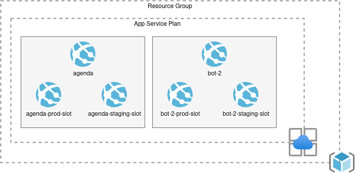

# [RFC-001] Migração do bot da agenda para a Azure

| Data                  | Responsáveis      | Colaborações                                            |
| --------------------- | ----------------- | ------------------------------------------------------- |
| 21 de fevereiro, 2022 | @Rehzende @lgfa29 | @DiogoMajela @selton00 @afernandescneto @phconte @gomex |

**Sumário:** Migração do bot de agenda do Discord do Heroku para a Azure.

O Discord da Mentoria IaC possui um bot que auxilia no agendamento de reuniões.
Atualmente esse bot roda no Heroku mas vamos trabalhar para migrá-lo para a
Azure usando o serviço App Service.

## Histórico

A Mentoria IaC é organizada de forma dinâmica através de reuniões marcadas por
qualquer pessoa que esteja a fim de trabalhar em algum item do projeto. Essas
reuniões são coordenadas no [Discord][discord] e o agendamento é feito através
de um bot.

O bot monitora o canal `#agenda` esperando por uma mensagem no formato
`>criar_agenda`. Depois dessa mensagem a pessoa que iniciou a agendamento
informa a data, o horário e o tema da reunião. O bot então envia uma mensagem
de confirmação e qualquer pessoa que colocar um emoji na mensagem recebe um
aviso do bot na hora que a reunião começar.

O código do bot é escrito em Python e está disponível no GitHub através do
repositório [`mentoriaiac/bot-discord-mentoria-agenda`][bot_repo]. As agendas
são armazenadas em um calendário no Google Calendar.

O código é empacotado em uma imagem Docker que é armazenada no serviço de
registry da [Heroku][heroku]. Essa imagem roda como um dyno na própria Heroku.

O deploy do bot é realizado através de uma Action no GitHub que usa a [Action
do Heroku][heroku_gh_action] para construir a imagem e subir a nova versão em
um passo só. Essa pipeline não possui nenhum tipo de validação extra, como
ambientes intermediários, verificação de vulnerabilidades, etc.

A Azure é a plataforma de serviços na nuvem da Microsoft. Um dos serviços
disponíveis é o [Azure App Service][app_service] que permite rodar aplicações
em diversas linguagens e ambientes de forma completamente gerenciada.

Para rodar uma aplicação no App Service é preciso criar um
[App Service Plan][app_service_plan] que define os detalhes de ambiente em que
a aplicação irá ser executada, como sistema operacional, CPU, memória etc. Um
mesmo App Service Plan pode ser utilizado por vários App Services. Recursos na
Azure são agrupados em um ou mais [Resource Group][azure_rg].

## Proposta

O bot será migrado para a Azure e utilizará o serviço App Service. A
configuração dos serviços na Azure será feita usando o Terraform. A pipeline
continuará utilizando o GitHub Actions mas irá estender os passos para separar
a parte de CI e CD que será integrado com o fluxo de trabalho com o git.

O resultado da pipeline será uma imagem Docker que irá ser armazenada e
distribuída pelo [Docker Hub][docker_hub]. O deploy da nova imagem será feita
com a Action [`azure/webapps-deploy@v2`][azure_gh_action].

Teremos dois ambientes na Azure, controlados por [slots do App Service][slots].
O slot de `staging` será atualizado toda vez que a branch `main` do repositório
for atualizada. O slot `prod` será atualizado quando uma tag nova de release
for criada.

A configuração e infraestrutura criada para o bot de Agenda poderá ser
reutilizada para outros bots, criando uma plataforma de bots e reduzindo o
atrito e o trabalho necessário para criar novos bots.

A arquitetura final da infraestrutura ficará assim:



### Ideias Abandonadas

#### Manter no Heroku

A proposta da Mentoria é de sempre explorar novas tecnologias, serviços e
práticas. O Heroku já é utilizado para outros projetos da Mentoria e surgiu uma
demanda para explorar mais a Azure.

A pipeline no Heroku também é muito simples e não segue algumas práticas mais
estabelecidas, como validação da imagem antes do deploy. A migração para a
Azure irá permitir mais flexibilidade e expansão das etapas realizadas na
pipeline.

## Configuração da Azure com Terraform

Para rodar o bot é necessário realizar uma série de configurações para preparar
e criar os recursos e serviços necessários na conta Azure que será utilizada.

Essa configuração será feita com o Terraform seguindo a prática de
infraestrutura-como-código. O código Terraform será organizado em um estrutura
multi-repo, composta de um repositório raiz que irá criar a infraestrutura base
da plataforma, um módulo para criar e gerenciar as instâncias de App Service e
slots na Azure e configurações específicas de cada bot que ficarão no mesmo
repositório que o código-fonte do bot e irá consumir o módulo e a plataforma.

### iac-plataforma-bots

`iac-plataforma-bots` será o repositório raiz que irá definir a infraestrutura
base da plataforma de bots. Nesse repositório será criado o resource group
([`azurerm_resource_group`][azurerm_resource_group]) onde os outro recursos dos
bots serão definidos e os App Service Plans
([`azurerm_service_plan`][azurerm_service_plan]) necessários para rodar os
bots.

#### Exemplos

`main.tf`

```hcl
resource "azure_resource_group" "bots" {
  name     = "plataforma-bots"
  location = "Brazil South"
}

resource "azurerm_service_plan" "bots" {
  name                = "bots"
  location            = azurerm_resource_group.bots.location
  resource_group_name = azurerm_resource_group.bots.name
  os_type             = "Linux"
  # ...
}
```

### iac-modulo-linux-app-service-docker

`iac-modulo-linux-app-service-docker` será um módulo Terraform quer irá definir
a estrutura padrão de um app que rode um container Docker em um host Linux. O
módulo será composto de um App Service Linux
([`azurerm_linux_web_app`][azurerm_linux_web_app]) e dois App Service Slots
([`azurerm_linux_web_app_slot`][azurerm_linux_web_app_slot]), um para staging
e outro para produção.

As variáveis de entrada do módulo irão definir os detalhes do App Service, como
nome, a imagem Docker do bot, `app_settings`, `tags` etc.

Adotar o Docker como opção padrão de execução permite simplificar a interface e
a implementação do módulo, uma vez que não é necessário suportar configurações
variadas de `site_config`.

#### Exemplos

`variables.tf`

```hcl
variable "name" {}
variable "image_prod" {}
variable "image_staging" {}
variable "app_settings_prod" {}
variable "app_settings_staging" {}
variable "resource_group_name" {}
variable "app_service_plan_id" {}
# ...
```

`main.tf`

```hcl
data "azurerm_resource_group" "rg" {
  name = var.resource_group_name
}

resource "azurerm_linux_web_app" "bot" {
  name                = var.name
  location            = data.azurerm_resource_group.rg.location
  resource_group_name = data.azurerm_resource_group.rg.name
  service_plan_id     = var.service_plan_id
  # ...
}

resource "azurerm_linux_web_app_slot" "prod" {
  name                = "${var.name}-prod"
  app_service_name    = azurerm_linux_web_app.bot.name
  app_service_plan_id = var.app_service_plan_id
  location            = data.azurerm_resource_group.rg.location
  resource_group_name = data.azurerm_resource_group.rg.name

  site_config {
    linux_fx_version = "DOCKER|${var.image_prod}"
  }

  app_settings = var.app_settings_prod
  # ...
}

resource "azurerm_linux_web_app_slot" "staging" {
  name                = "${var.name}-staging"
  app_service_name    = azurerm_linux_web_app.bot.name
  app_service_plan_id = var.app_service_plan_id
  location            = data.azurerm_resource_group.rg.location
  resource_group_name = data.azurerm_resource_group.rg.name

  site_config {
    linux_fx_version = "DOCKER|${var.image_staging}"
  }

  app_settings = var.app_settings_staging
  # ...
}
```

`outputs.tf`

```hcl
output "prod_slot_id" {
  value = azurerm_linux_web_app_slot.prod.id
}

output "staging_slot_id" {
  value = azurerm_linux_web_app_slot.staging.id
}
# ...
```

### Repositório dos bots

Dentro de cada repositório dos bots será criada uma pasta chamada `infra` onde
ficará a configuração Terraform do bot. Essa configuração consumirá o módulo
`iac-modulo-app-service-docker` e recursos criados na `iac-plataforma-bots`.

O deploy da infraestrutura do bot estará associado ao deploy do código-fonte. A
cada versão nova do bot, a variável da tag da imagem Docker será atualizada
para usar a nova versão. O uso do formato JSON para definir o valor da variável
facilita a manipulação desse valor de forma programática.

#### Exemplos

`infra/main.tf`

```hcl
# Referências para a infraestrutura providenciada pela plataforma.
data "azurerm_resource_group" "plataforma_bots" {
  name = "plataforma-bots"
}

data "azurerm_service_plan" "bots" {
  name                = "bots"
  resource_group_name = data.azurerm_resource_group.plataforma_bots.name
}

module "bot_agenda" {
  source = "github.com/mentoriaiac/iac-modulo-app-service-docker.git?ref=v0.1.0"

  name                = "bot-agenda"
  resource_group_name = data.azurerm_resource_group.plataforma_bots.name
  app_service_plan_id = data.azurerm_service_plan.bots.id

  image_prod    = "metoria-iac/bot-agenda:${var.image_prod_tag}"
  image_staging = "metoria-iac/bot-agenda:${var.image_staging_tag}"

  app_settings_prod = {
    "KEY" = "value"
    "DISCORD_TOKEN" = var.discord_token_prod
  }

  app_settings_staging = {
    "KEY" = "value"
    "DISCORD_TOKEN" = var.discord_token_staging
  }
}
```

`infra/variables.tf`

```hcl
variable image_prod_tag {}
variable image_staging_tag {}
variable discord_token_prod {}
variable discord_token_staging {}
```

`infra/terraform.tfvars.json`

```json
{
  "image_prod_tag": "v1.0.0"
  "image_staging_tag": "f5956b1"
}
```

### Ideias Abandonadas

#### Módulos para resource group, App Service e App Service Plan

Uma outra forma de separar a configuração Terraform seria criar módulos para as
partes individuais, como, por exemplo, `iac-modulo-resource-group`,
`iac-modulo-app-service` e `iac-modulo-app-service-plan`.

Mas estes módulos seriam apenas uma camada fina sobre os resources que estariam
por baixo, não providenciando muito valor em termos de abstração e organização
do código.

Definir um único módulo que engloba vários resources que seriam comuns a vários
deployments de bots possui mais valor por simplificar como bots são definidos,
escondendo os detalhes do App Service, slots etc.

#### Centralizar a infraestrutura dos bots no repositório da plataforma

A declaração da infraestrutura de cada bot poderia ser definida dentro do
repostirório da plataforma (`iac-plataforma-bots`). Porém, isso criaria uma
lacuna entre o produto e a infraestrutura: modificações no código-fonte da
aplicação teriam que ser propagados de um repositório para outro.

Manter o código de infraestrutura junto como o código de aplicação permite a
criação de um pipeline completo de ponta a ponta no mesmo repositório.

Uma outra vantagem é reduzir a zona de impacto de mudanças. Isolando a
configuração específica de cada bot previne com que um projeto afete o outro ou
afete a plataforma em si. Aplicando alterações no nível da aplicação também
reduz o número de vezes que é preciso aplicar alterações na infraestrutura da
plataforma.

## Pipelines de deploy

Para transformar código em infraestrutura serão criados diversos pipelines em
cada um dos repositórios para automatizar o processo. As etapas presentes em
cada pipeline irão depender do tipo de código no repositório.

### Pipeline Terraform

Os repositórios Terraform irão usar GitHub Actions para executar pipelines de
CI/CD.

No repositório raiz `iac-plataforma-bots`, a parte de CI acontecerá a cada
commit e PR. Serão executadas tarefas básicas de validação, como
`terraform fmt` e `terraform validate`. A parte de CD acontecerá na branch
`main` toda a vez que uma tag de release for criada, e `terraform plan` e
`terraform apply` serão executados.

O repositório do módulo `iac-modulo-app-service-docker` irá executar as mesmas
ações de CI, e usará uma configuração de exemplo para validação de CD que será
destruída automaticamente.

### Pipeline do Bot

A parte de CI irá incluir várias etapas. Os primeiros passos serão feitos sobre
o código-fonte, como linters, testes estáticos, testes unitários, etc. e irão
rodar a cada commit e PR.

Quando o PR for aprovado e a branch for integrada à `main`, o pipeline de CD
para staging será iniciado. Esse pipeline irá construir a imagem Docker e
publicá-la no Docker Hub usando a versão curta (7 caracteres) do SHA do commit.
Depois de publicada, o arquivo de variáveis será editado para atualizar a
variável `image_staging_tag` para o valor da nova tag. Essa modificação irá ser
integrada de volta ao repositório através de um commit e push para manter o
registro de alteração da infraestrutura. A configuração do Terraform será então
aplicada para atualizar o slot de staging na Azure.

O pipeline de produção será parecido, mas irá ser iniciado a partir da criação
de uma tag de release. A imagem Docker será criada e publicada no Docker Hub
usando a tag git como tag da imagem. A variável `image_prod_tag` será
atualizada para esse novo valor e a aplicando a configuração do Terraform irá
atualizar o slot de produção na Azure.

## Configuração de Slots

Cada slot do bot irá apontar para um servidor Discord diferente a fim de
nos permitir validar mudanças no código sem afetar o servidor Discord oficial
da Mentoria.

Os valores dos tokens de autenticação serão definidos como uma variável de
ambiente em cada slot do App Service. Esses valores serão armazenados no
repositório como [segredos encriptados][gh_action_secrets] para que o pipeline
consiga consumi-los.

[app_service]: https://azure.microsoft.com/en-us/services/app-service
[app_service_plan]: https://docs.microsoft.com/en-us/azure/app-service/overview-hosting-plans
[azure_gh_action]: https://github.com/marketplace/actions/azure-webapp
[azure_rg]: https://docs.microsoft.com/en-us/azure/azure-resource-manager/management/manage-resource-groups-portal
[azurerm_linux_web_app]: https://registry.terraform.io/providers/hashicorp/azurerm/latest/docs/resources/linux_web_app
[azurerm_service_plan]: https://registry.terraform.io/providers/hashicorp/azurerm/latest/docs/resources/service_plan
[azurerm_linux_web_app_slot]: https://registry.terraform.io/providers/hashicorp/azurerm/latest/docs/resources/linux_web_app_slot
[azurerm_resource_group]: https://registry.terraform.io/providers/hashicorp/azurerm/latest/docs/resources/resource_group
[bot_repo]: https://github.com/mentoriaiac/bot-discord-mentoria-agenda
[discord]: https://discordapp.com
[docker_hub]: https://hub.docker.com/
[gh_action_secrets]: https://docs.github.com/pt/actions/security-guides/encrypted-secrets
[heroku]: https://heroku.com/
[heroku_gh_action]: https://github.com/marketplace/actions/deploy-to-heroku
[slots]: https://docs.microsoft.com/en-us/azure/app-service/deploy-staging-slots
[sqlalchemy]: https://www.sqlalchemy.org/
